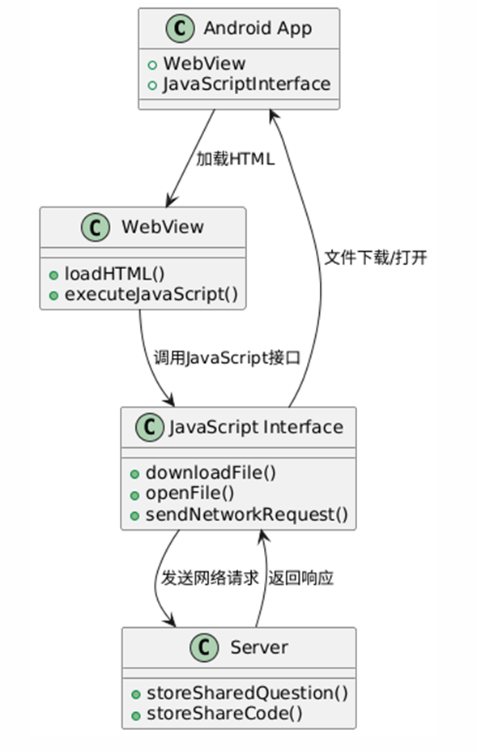
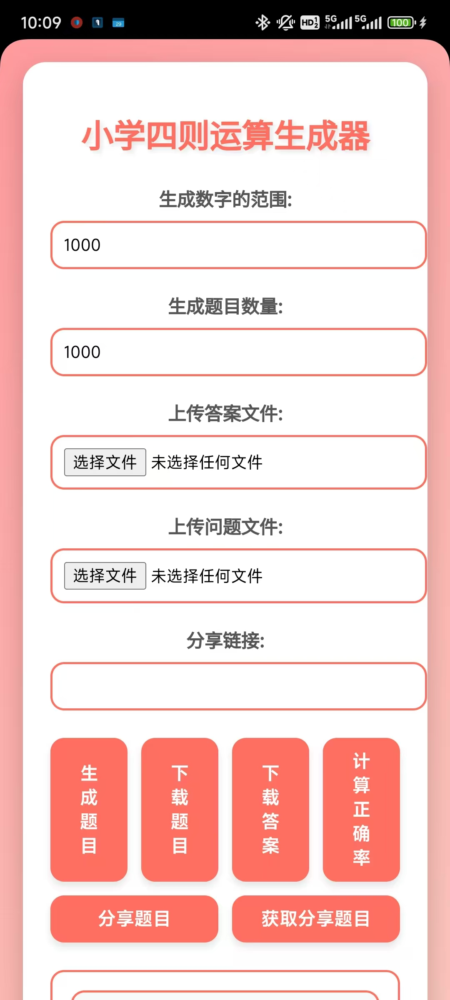

**Elementary Math Problem Generator**

### **I. Product Features**

#### **1. Core Functionality**

1. **Problem Generation**
   - Users can specify the numerical range and quantity of problems to generate.
   - Problems are exported in **TXT format** and saved in the Android file system under `question_timestamp.txt`.
2. **Upload Problem & Answer Files**
   - Users can separately upload problem files and answer files.
   - The system parses the answer file and matches it with the generated problems.
3. **Correctness Calculation**
   - The system compares user-submitted answers with correct answers and calculates accuracy.
   - Results are displayed as a **percentage**, along with a **detailed breakdown** (correct/incorrect status for each problem).
4. **Export Score Report**
   - Users can export results as a **TXT score file**, including:
     - Overall accuracy
     - List of correctly answered problems
5. **Share Problems**
   - Users can **share problems** via a **unique share code**.
   - Others can input the code to retrieve the same problem set.

### **II. Technical Implementation**

#### **1. Android Client**

- Uses **WebView** to embed an HTML-based UI for problem display and interaction.
- **JavaScriptInterface** enables Java-JS communication for network requests and local storage access.

#### **2. Server-Side**

- **RESTful API** built with **Java Spring Boot** for data storage and processing.
- **MySQL** database stores problem sets and user submissions.

#### **3. Frontend**

- **HTML/CSS/JavaScript** for responsive layouts, styling, and dynamic interactions.
- **HTTP requests** for real-time data exchange with the server.

### **IV. Future Development Directions**

1. **Expand Problem Types**
   - Support additional question formats (e.g., multiple-choice, fill-in-the-blank, true/false).
2. **Optimize Problem-Generation Algorithms**
   - Improve the **accuracy** and **diversity** of generated problems.
3. **Enhance User System**
   - Introduce **user registration**, **login**, and **reward mechanisms** (e.g., points system) to boost engagement.
4. **Develop Mobile Applications**
   - Port the app to **iOS** to expand the user base.

### **V. Conclusion**

This product is a **practical and scalable** problem-generation and sharing tool with strong market potential. Moving forward, we will continue refining features and optimizing the user experience to deliver **higher-quality services**.